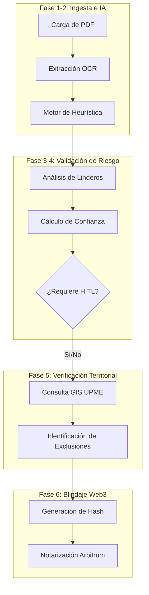

# 📘 Especificación Técnica: Lógica y Flujo del Servicio Agneex LandTech

## 1. Introducción
Agneex LandTech es una plataforma "End-to-End" diseñada para mitigar el riesgo en la adquisición y gestión de tierras rurales. El servicio combina **Inteligencia Artificial Propietaria**, **Validación Geoespacial (GIS)** y **Notarización Web3** para crear un expediente digital inmutable y verificado.

---

## 2. Flujo Macroscópico del Servicio
El servicio se divide en seis fases críticas, desde la captura del documento hasta su blindaje jurídico en blockchain.

---

## 3. Detalle de la Lógica por Fase

### Fase 1 & 2: Ingesta e IA (Extracción de Datos)
El sistema utiliza un pipeline de procesamiento de lenguaje natural (NLP) simplificado para clasificar y entender el contenido:
- **Identificación de Tipo**: Busca patrones semánticos como *"Escritura"* o *"Notaría"* para clasificar como **Escritura Pública** (Confianza Base: 88%) o *"Contrato"* para **Contrato Privado** (Confianza Base: 75%).
- **Identificación de Entidad**: Localiza la palabra clave *"predio"* y extrae un snippet contextual para nombrar el registro automáticamente.

### Fase 3 & 4: Análisis de Linderos y Scoring
Esta es la fase de detección de **riesgo técnico**:
- **Lógica de Coordenadas**: El sistema busca términos técnicos (coordenadas, rumbos, grados, metros). 
- **Alerta de Ambigüedad**: Si se detectan linderos pero no hay referencias topográficas, se dispara la alerta `AMBIGUEDAD_LINDEROS`.
    - **Gravedad**: ALTA.
    - **Impacto**: Se resta un 15% al puntaje de confianza y se marca para revisión humana obligatoria.

### Fase 5: Validación Territorial (GIS/UPME)
Se realiza una consulta cruzada con cartografía gubernamental para detectar colisiones con la Ley 685 (Código de Minas):
- **Zonas de Exclusión**: El algoritmo busca coincidencias espaciales con:
    - Reservas Naturales / Páramos.
    - Resguardos Indígenas.
    - Cuencas hidrográficas (Ríos).
- **Resultado**: Si hay coincidencia, el estado cambia a `INTERSECCION_DETECTADA`, bloqueando preventivamente la certificación de "tierra limpia".

### Fase 6: Notarización Web3 (Anclaje de Inmutabilidad)
Para garantizar que el análisis no sea alterado a futuro, se ancla a la red **Arbitrum Sepolia**:
- **El Hash Inmutable**: Se genera un `SHA-256` que combina:
    1. ID Único del Registro.
    2. Nombre de la Entidad.
    3. Texto extraído del documento original.
- **Relayer Gasless**: El sistema firma la transacción automáticamente desde el backend (`LandRegistry.sol`), permitiendo que el operario no necesite manejar criptomonedas ni wallets (Abstracción de Cuenta).

---

## 4. Matriz de Decisiones (Resumen)

| Escenario | Acción del Sistema | Estado Final |
| :--- | :--- | :--- |
| Documento sin texto extraíble | Disparo de alerta `OCR_NO_TEXT` | Revisión Humana requerida |
| Falta de coordenadas técnicas | Alerta `AMBIGUEDAD_LINDEROS` | Score de Confianza < 70% |
| Cruce con Páramo/Reserva | Alerta `INTERSECCION_DETECTADA` | Bloqueo de Notarización |
| Análisis Exitoso (Confianza > 85%) | Preparación para Notarización | Certificado Web3 Generado |

---
## 5. Seguridad y Confianza
La arquitectura garantiza que cada paso sea auditable. El hash almacenado en las redes L2 de Ethereum sirve como un sello de tiempo y contenido que puede ser verificado por cualquier tercero interesado (compradores, bancos o entidades estatales) sin necesidad de acceder a los servidores privados de Agneex.
