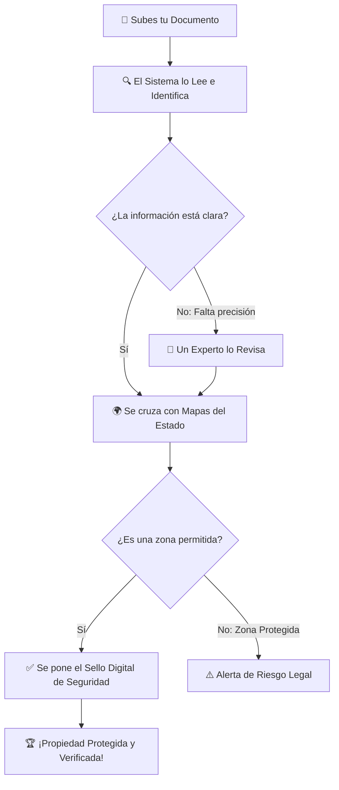

# 📝 Guía Práctica: ¿Cómo Funciona el Servicio de Agneex LandTech?

Esta guía explica de forma sencilla cómo nuestra tecnología protege y valida la propiedad rural, asegurando que cada terreno sea una inversión segura y legal.

---

## 🗺️ Mapa Visual del Proceso
Para que sea más fácil de entender, aquí tienes cómo viaja tu documento por nuestro sistema:

*(Si no ves el diagrama arriba, aquí tienes el flujo en texto)*:
1. **Subes tu Documento** ➔ 2. **El Sistema lo Lee** ➔ 3. **¿Viene Completo?**
   - *Si SI*: ➔ 4. **Cruce con Mapas UPME**
   - *Si NO*: ➔ ➔ **Revisión Humana** ➔ ➔ 4. **Cruce con Mapas UPME**
5. **¿La tierra es apta?**
   - *Si SI*: ➔ 6. **Sello Digital Inalterable** ➔ 🏆 **ÉXITO**
   - *Si NO*: ➔ ❌ **Alerta de Riesgo**

---

## 1. Recepción y Lectura Inteligente
El proceso comienza cuando se sube un documento (como una escritura o un contrato). 
- **¿Qué hace el sistema?**: "Lee" el documento automáticamente para entender de qué se trata, sin que nadie tenga que transcribirlo manualmente.
- **Resultado**: El sistema sabe de inmediato si es una Escritura Pública o un Contrato Privado y a qué predio se refiere.

## 2. Control de Calidad de Linderos (Bordes del Terreno)
Uno de los mayores riesgos en el campo es que los límites de un terreno no estén claros.
- **¿Qué hace el sistema?**: Busca si el documento menciona coordenadas técnicas y medidas precisas.
- **Alerta temprana**: Si el sistema detecta que el documento solo da descripciones vagas (como "limita con el árbol de roble"), marca el expediente con una **alerta de riesgo alto**. Esto significa que se necesita un experto humano para verificar que no haya problemas con los vecinos en el futuro.

## 3. Chequeo de Zonas Prohibidas (UPME)
Antes de dar el visto bueno, verificamos si el terreno está en un lugar donde no se puede construir o explotar.
- **¿Qué hace el sistema?**: Cruza la información del terreno con los mapas oficiales del gobierno (UPME).
- **Protección**: Detecta si el terreno está sobre un río, en un páramo, en una reserva indígena o en una zona de exclusión minera. Si hay un cruce, el sistema te avisa para evitar problemas legales con el Estado.

## 4. Revisión por Expertos (HITL)
No todo lo hace la máquina. Si el sistema tiene dudas sobre la claridad del documento o detecta un riesgo, el expediente pasa a un **Panel de Revisión Humana**.
- **Valor**: Un experto analiza la alerta y decide si el proceso puede seguir adelante o si se requiere corregir algo legalmente.

## 5. El Sello Digital de Seguridad (Blockchain)
Una vez que el terreno ha pasado todas las pruebas, queremos que nadie pueda cambiar esa información.
- **¿Qué hace el sistema?**: Crea un **Sello Digital Único e Inalterable**. Es como ponerle un sello de notaría digital que vive para siempre en una red segura.
- **Beneficio**: Si en 10 años alguien intenta decir que el análisis fue distinto, el Sello Digital demostrará la verdad original. Es la máxima garantía de confianza para compradores y bancos.

---

## Resumen del Valor Agregado
1. **Velocidad**: Lo que antes tomaba días de lectura manual, se hace en segundos.
2. **Seguridad**: Detectamos riesgos técnicos que el ojo humano podría pasar por alto.
3. **Legalidad**: Verificamos colisiones con leyes ambientales y mineras al instante.
4. **Confianza**: El resultado final es un expediente blindado digitalmente.

---
> *Agneex LandTech: La forma inteligente y segura de gestionar la tierra.*
