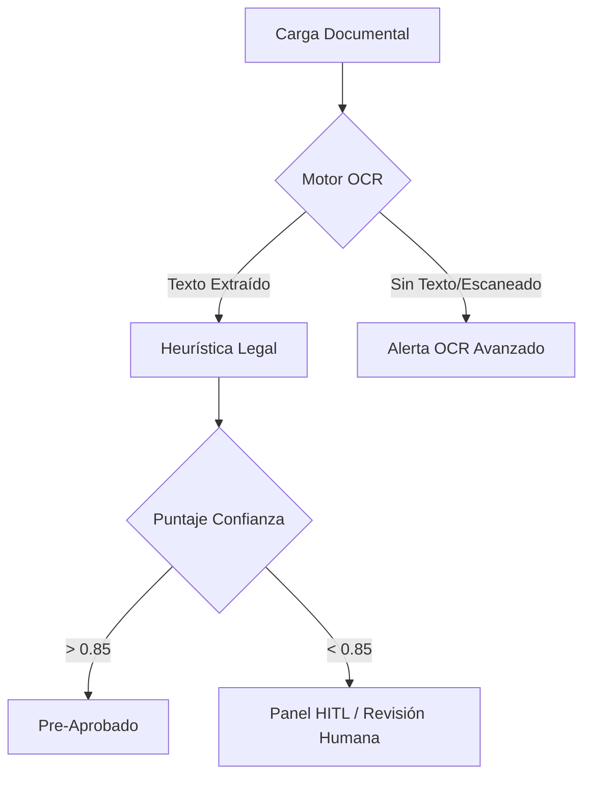
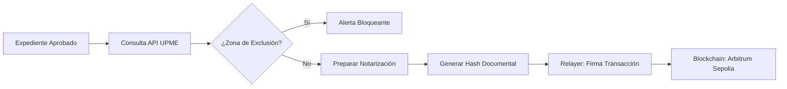

# 🟣 Agneex LandTech - Professional Demo Platform

[](https://agneex.com)
[](https://sepolia.arbiscan.io)

Plataforma técnica de auditoría, validación y notarización de títulos de propiedad rural impulsada por **Inteligencia Artificial** y **Blockchain**. Este repositorio contiene el núcleo lógico para la ingesta de documentos, validación geoespacial y anclaje de inmutabilidad.

---

## ⚙️ Core Arquitectónico y Lógica de Negocio

El sistema se basa en tres pilares fundamentales que garantizan la trazabilidad y legalidad de los activos inmobiliarios:

### 1. Motor de Análisis Documental (IA Legal)
El backend procesa documentos legales (PDF) mediante un pipeline de extracción y heurística:
- **OCR & Parsing**: Extracción de texto estructurado mediante `PyPDF2` y validación de integridad.
- **Heurística de Riesgo**: Algoritmos de detección de palabras clave para identificar:
    - Tipología documental (Escrituras vs Contratos).
    - Ambigüedades en linderos (referencias técnicas vs descriptivas).
    - Entidades y predios involucrados.

### 2. Validación Geoespacial (GIS & UPME)
Integración con bases de datos gubernamentales para la verificación de restricciones territoriales:
- **Exclusión Minera (Ley 685)**: Verificación automática de cruces con zonas de exclusión de la **UPME**.
- **Restricciones Ambientales**: Identificación de intersecciones con páramos, reservas naturales y zonas protegidas.
- **Human-In-The-Loop (HITL)**: Los casos con baja confianza o alertas críticas son derivados a un panel de expertos para su validación manual.

### 3. Notarización e Inmutabilidad (Web3)
Anclaje de la "Verdad Legal" en la red **Arbitrum Sepolia**:
- **Hashing**: Generación de un `SHA-256` único que encapsula el expediente completo (ID, Entidad, Texto Extraído).
- **Smart Contracts**: Registro de inmutabilidad mediante el contrato `LandRegistry`.
- **Relayer Gasless**: Implementación de un flujo donde el servidor actúa como proponente de la transacción, eliminando la fricción del "Gas" para el usuario final.

---

## 📊 Flujos de Proceso

### A. Onboarding y Navegación (Landing to App)
El flujo de entrada comienza en la **Landing Page**, donde el usuario selecciona un nivel de suscripción, lo que determina su experiencia de registro y su rol dentro de la plataforma principal:

- **Plan Starter (Gratis)**: Registro Directo ➔ Redirección al *User Dashboard* (Rol: Cliente, Límite: 3 Docs).
- **Plan Professional / Business**: Registro ➔ *Pasarela de Pagos Simulada* ➔ Redirección al *User Dashboard* (Rol: Analista/Admin, Límites ampliados).
- **Plan Enterprise**: Formulario de Contacto Corporativo ➔ Integración Offline.

**Conexión con la Plataforma:** Al completar exitosamente el registro o pago, la interfaz enruta al usuario instantáneamente al ecosistema central (`UserDashboard`). Este panel adapta dinámicamente las métricas de consumo mensual de IA, las oportunidades estratégicas (CAPEX) y las vistas habilitadas según el plan adquirido previamente.

### B. Ingesta y Análisis Inicial


### C. Validación Territorial y Notarización Web3


---

## 🛠️ Stack Tecnológico

- **Backend**: FastAPI (Python 3.13), SQLAlchemy (SQLite), Web3.py.
- **Frontend**: React 18, Vite, Tailwind CSS (Design System "Deep Purple").
- **Blockchain**: Solidity, Arbitrum Sepolia Testnet.

---

## 🎮 Guía de la Demo

1. **Onboarding:** Explora los planes en la pantalla principal y selecciona uno. 
    - *Tip: Para acceso rápido, selecciona "Starter" y completa el registro simulado.*
    - *Tip alternativo: Haz clic en "Login" en la barra de navegación usando `demo@agneex.com` / `agneex2025`.*
2. **Dashboard:** Revisa el panel de control de usuario y las métricas de consumo de tu Tier.
3. **Ingesta:** Haz clic en "Nuevo Análisis" y carga un PDF (ej. Escritura de Compraventa) en el módulo `Subir Archivo`.
4. **Validación:** Observa el análisis de linderos extraído por la IA y el cruce automatizado con la **UPME**.
5. **Blockchain:** Ejecuta la notarización (gasless) y verifica el hash de inmutabilidad en Arbiscan.

---

## ⚡ Ejecución

1. **Backend:** 
   ```powershell
   cd backend
   C:\Users\HP\AppData\Local\Programs\Python\Python313\python.exe -m uvicorn main:app --reload
   ```
2. **Frontend:**
   ```powershell
   cd frontend
   npm run dev
   ```

---
> *Core Logic developed by Agneex LandTech Engineering.*
