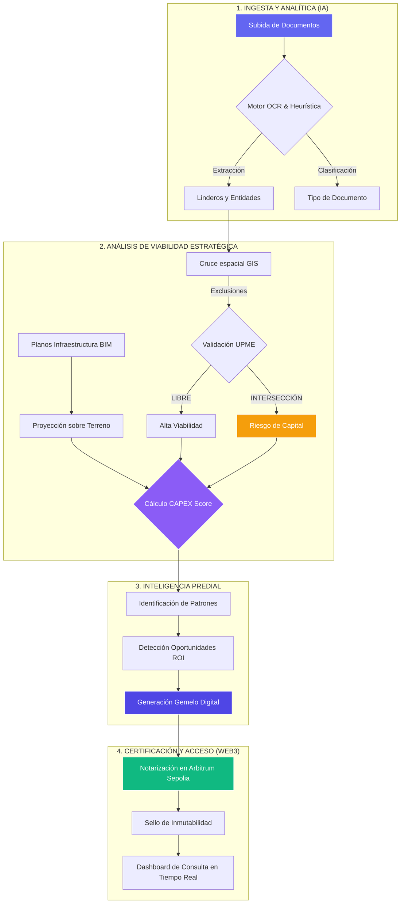

# 🛰️ Workflow Agneex LandTech: Ecosistema Digital Twin & CAPEX

Este diagrama representa el flujo completo de la plataforma, desde la ingesta de documentos hasta la generación del Gemelo Digital y la certificación inmutable en la Blockchain de Arbitrum.

## 📋 Resumen de Etapas

1.  **Ingesta de IA**: Se procesan PDFs y textos para extraer el ADN legal del predio.
2.  **Viabilidad GIS/BIM**: Se cruza la ubicación física con la infraestructura proyectada (CAPEX) y las exclusiones del Estado (UPME).
3.  **Gemelo Digital**: Se crea una representación unificada que permite visualizar riesgos y oportunidades de inversión.
4.  **Certificación Web3**: Se guarda un hash inmutable en la blockchain, asegurando que la viabilidad del capital no pueda ser alterada.

---
> *Agneex: Claridad en el territorio, seguridad en la inversión.*
